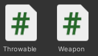
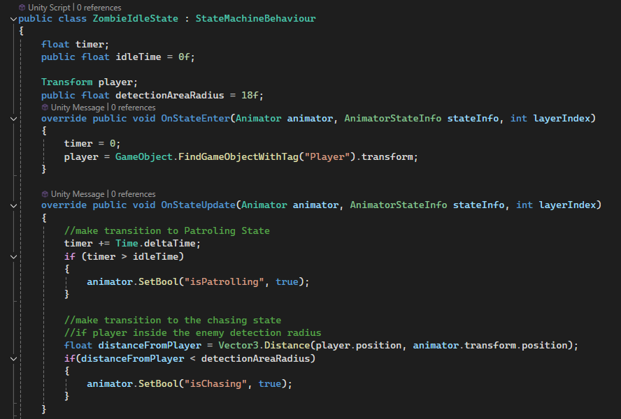

# 🚀 FPS Game

Welcome to FPS Game V2, an adrenaline-fueled first-person shooter game developed in Unity! Get ready to dive into intense action, epic shootouts, and dynamic gameplay that keeps you on the edge of your seat.

## 🎮 Project Overview

### FPS Game comes packed with:

- First-person shooting mechanics that are smooth and responsive.
- Dynamic level design with exciting environments to explore.
- Interactive enemies and obstacles that will test your skills.
- Precision controls for an immersive and rewarding player experience.

## 🌐 Online

Check out the game online and dive into the action today! [FPS Game V2 on Itch.io](https://noychen.itch.io/firstpsv14)

## 🔥 Key Features

- **Modular Components**: The game architecture is heavily based on the **Components Pattern**, where each behavior or functionality is encapsulated in reusable and independent components. This ensures scalability and maintainability.
  Throwable or Weapon scripts are making every object a weapon or throwable
  
  
- **State Machines**: Player and enemy behaviors are managed using **finite state machines (FSM)**, ensuring smooth transitions between states like idle, attacking, patrolling, and fleeing.
  Zombie state machine for each of the enemies includes some states like: Attack, Chase, Idle, Patrol. Here is one example of state machine
  
  
- **Weapon System**: Arm yourself with a variety of weapons to take down enemies with style.
  Weapon system responsible for pick up, throw and ammo management.
- **Dynamic Enemy**: Battle against intelligent enemies that adapt to your every move.
- **Immersive Graphics and Sound**: Stunning visuals and impactful sound effects bring the battlefield to life.
- **User-friendly Controls**: Smooth, intuitive controls for the best gaming experience.

## 🎮 Controls

### Game Instructions

#### Collecting Items
- **Collect Weapons, Grenades, Ammo Boxes**: Press **F** to pick up weapons, grenades, and ammo boxes.

#### Weapons Management
- **Store Weapons**: You can carry and store up to 2 weapons. Use **Alpha1** to equip the first weapon and **Alpha2** to equip the second weapon.

#### Throwing Items
- **Throw Grenade**: Press **G** to throw a grenade.
- **Throw Tactical Item**: Press **T** to throw a tactical item (e.g., flashbang, smoke grenade).

#### Movement and Actions
- **Move**: Use the **W/A/S/D** keys to move forward/left/backward/right, and the **mouse** to look around.
- **Jump**: Press **Space** to jump.

#### Shooting
- **Shoot Enemies**: Use the **left mouse button** to shoot.
- **Automatic Shooting**: Hold down the **left mouse button** for continuous fire.
- **Burst Shooting**: Click the **left mouse button** for burst fire.

#### Aiming Down Sights (ADS)
- **Use ADS**: Press the **right mouse button** to aim down sights for better accuracy.
